### Sitio web para Taller-HS

## Indice

- [Objetivos](#objetivos)
- [Funcionalidad del proyecto](#funcionalidad)
  - [Roles](#roles)
  - [Complejidad](#complejidad)
  - [Funcionalidades por Rol](#funcionalidades-por-rol)
- [Entrega: Reportes y Estadísticas](#reportes-estadisticas)

<a name="objetivos"/>

## Objetivos

Este proyecto surgio como una alternativa de desarrollo planteada a los alumnos de la Universidad
Católica Argentina en el marco de la materia Proyecto Integral de Desarrollo, cuyo objetivo es mejorar las
prácticas de programación trabajando en diversos proyectos que otorguen y agreguen valor a los
clientes.

Taller HS es un emprendimiento que se dedica a la confección de diversas prendas de ropa
personalizadas en base a las necesidades y pedidos particulares de cada cliente.

Los objetivos del proyecto a desarrollar consisten en agilizar la creación de nuevas cotizaciones de
prendas y mantener un seguimiento del flujo de los estados de las órdenes creadas, con la finalidad que
los clientes dispongan de un sitio para visualizar sus órdenes y los estados en los que se encuentran.

Este desarrollo web permitirá a Taller HS facilitar la parte de la cotización de prendas y a la vez que ahorrar tiempo
a la hora de informar al cliente el estado de sus órdenes, ya que será posible consultarlas dentro del
portal web.

<a name="funcionalidad"/>

## Funcionalidad del proyecto

<a name="roles"/>

### Roles

En la aplicacion se tienen 4 roles de los usuarios que se registran:

- **Cliente**: un usuario que puede crear ordenes y visualizarlas.
- **Prestador de Servicio**: un usuario, que esta por fuera del HS Taller, que trabaja en las ordenes.
- **Administrador**: un usuario con posibilidad de gestionar todas las ordenes, servicios, usuarios, reportes y estadisticas.
- **Ayudante**: un usuario ,que forma parte de HS Taller, que trabaja en las ordenes.

<a name="complejidad"/>

### Complejidad

Uno de los puntos más importantes a la hora de determinar el precio de las prendas a producir es poder determinar su complejidad. Según que tan compleja sea una prenda, su precio va a variar y el estimado que el cotizador arroje se verá modificado. Se establecieron seis distintas complejidades:

- Básico.
- Medio.
- Complejo.
- Muy Complejo.
- Ultra Complejo.
- Extremadamente Complejo.

Para que el cotizador pueda funcionar de manera precisa indicando el precio, es necesario que tenga en cuenta cuál es la complejidad de la prenda.

<a name="funcionalidades-por-rol"/>

### Funcionalidades por Rol

Se describiran las funcionalidades principales brindadas por la aplicación por rol de usuario:

- **Cliente**

  - Poder crear una orden y obtener su precio estimado para los usuarios Cliente: 
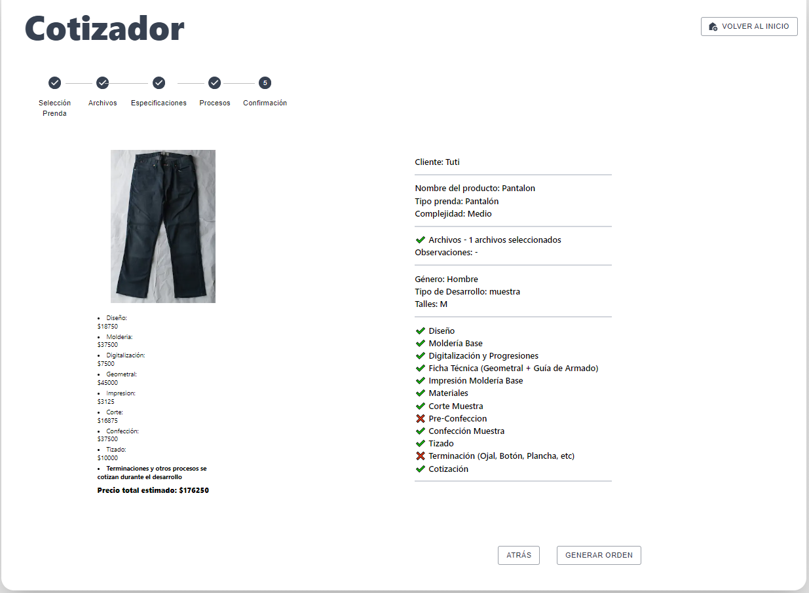

  - Poder visualizar las ordenes creadas: 
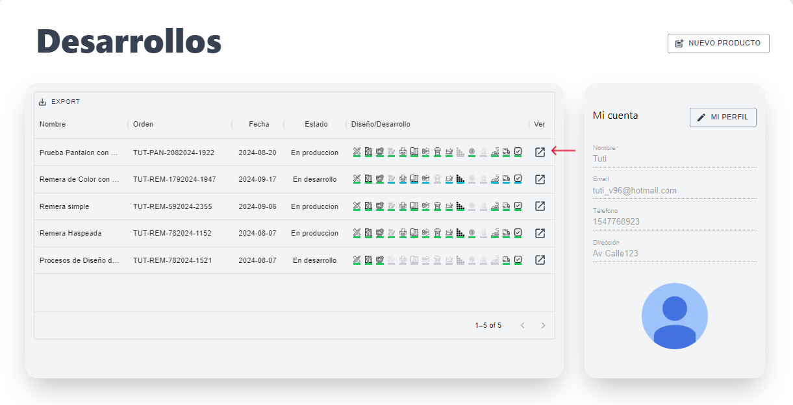

  - Poder editar sus propios datos: 
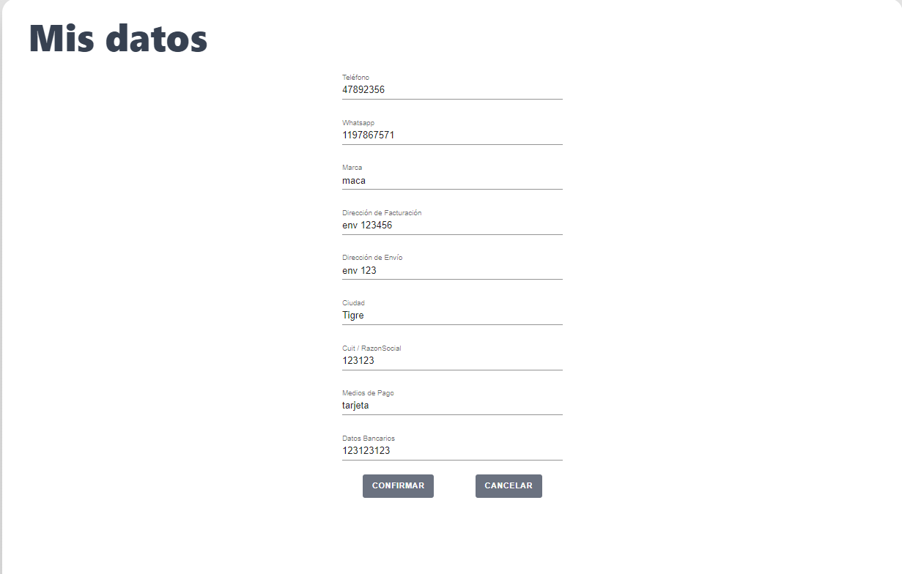

- **Prestador de Servicio**:

  - Poder visualizar y trabajar en las ordenes en donde se le fue asignado un proceso: 
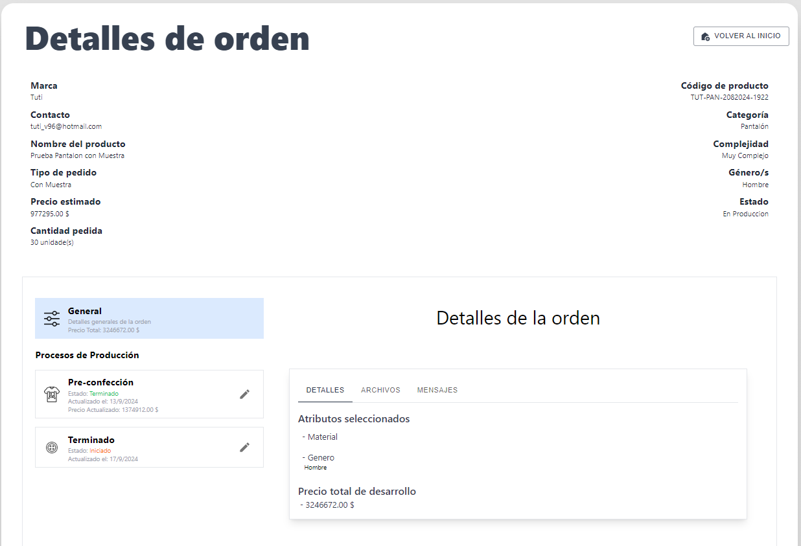

  - Poder editar sus propios datos: 
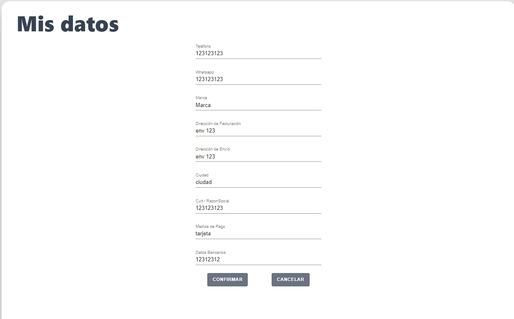

  - Poder editar sus propios precios de servicios: 
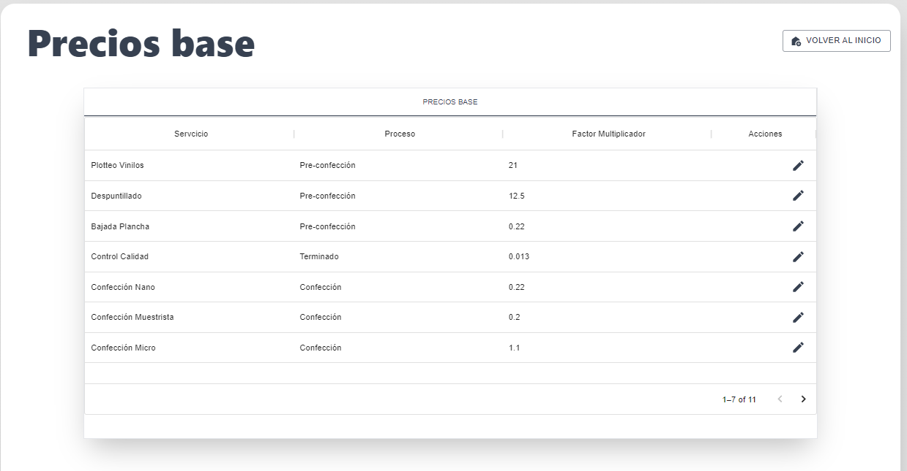

- **Administrador**:

  - Poder visualizar y trabajar en todas las ordenes creadas: 
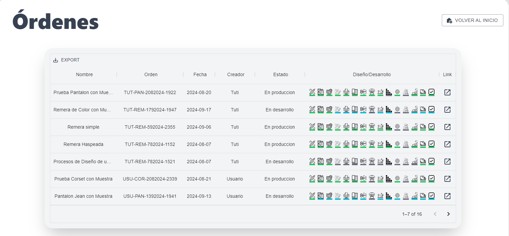

  - Poder editar sus propios precios de servicios: 

  - Poder editar los usuarios: 
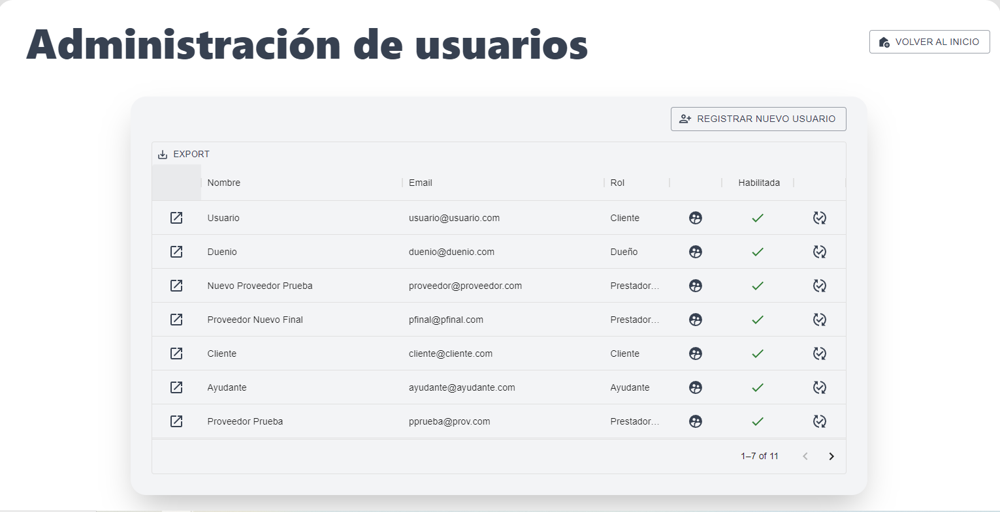

  - Poder ver los reportes y estadisticas de las ordenes: 
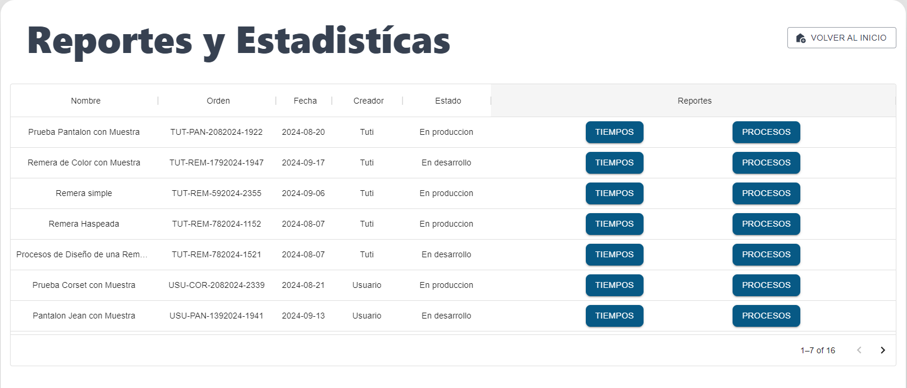

- **Ayudante**:
  - Poder visualizar y trabajar en todas las ordenes creadas: 
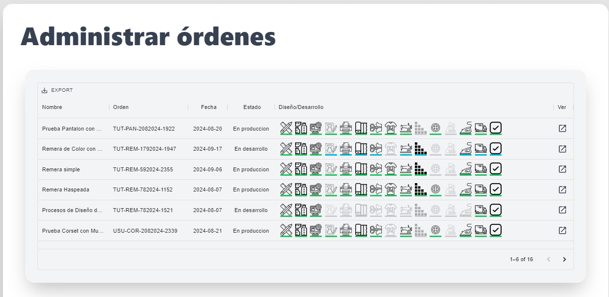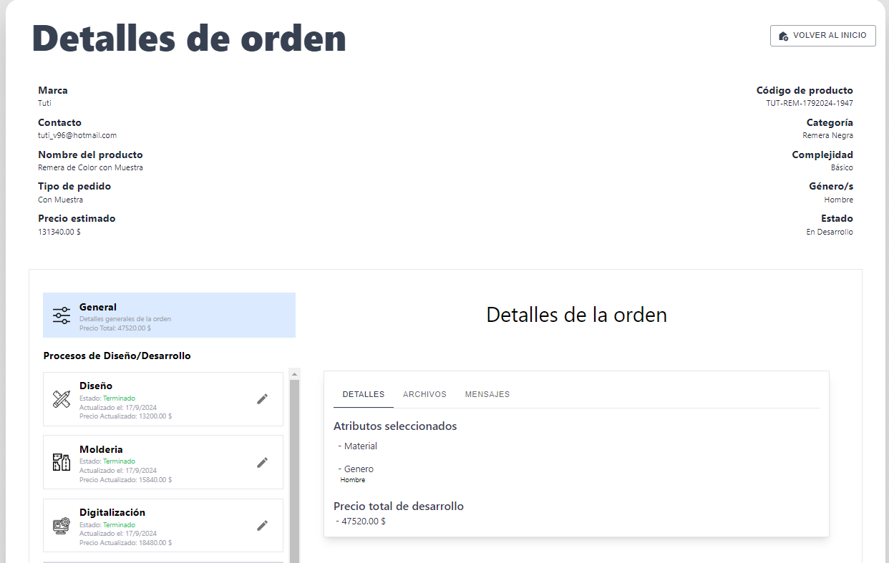

<a name="reportes-estadisticas"/>

## Entrega: Reportes y Estadísticas

Para esta entrega se incorporó reportes y estadísticas a las órdenes que se trabajan en la aplicacion.

El usuario con rol *Administrador* es el que va a poder gestionar los distintos reportes y estadísticas de todas las órdenes. Al ser el dueño del taller, podra ver la información que cada proceso genera mientras se trabaja en la orden.

El usuario con rol *Ayudante* también podra gestionar los reportes que se guardan a la aplicacion ya que correspondera a una persona trabajando en el taller junto con el usuario *Administrador*.

El usuario con rol *Prestador de Servicio* podra gestionar solamente los reportes asociados a los procesos que le fueron asignados.

En la aplicación se podrá ver los reportes en la pestaña *Reporte* al ir seleccionando cada proceso en cada orden.

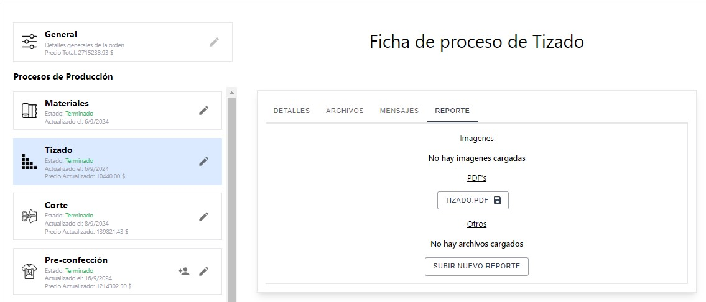

### Reportes

Los reportes, en la aplicación, están relacionadas tanto a los procesos de Diseño/Desarrollo como a los de Producción. Cada reporte sera diferente en cada proceso.

#### Reporte de Diseño/Desarrollo

Los reportes para Diseño/Desarrollo son:
* Diseño: El reporte de Diseño consiste la carga de un comentario de texto explicando sobre como se llevo a cabo el diseño de la prenda.

* Moldería: El reporte de Moldería consiste en la carga de un archivo PDF que es la moldería de la prenda.

* Digitalización y Progresión: Los reportes de Digitalización y Progresión consisten en una carga de cantidades de moldes, avíos, taller y materiales junto con 2 archivos excel y 2 archivos PDF's.

* Geometral: El reporte de Molderia consiste en la carga de 5 imagenes que forman parte del geometral de la prenda.

* Impresion: El reporte de Impresion consiste en la carga de la cantidad de metros que fueron impresos de la molderia.

* Tizado: El reporte de Tizado consiste en la carga de uno o varios archivos de la tizada de la prenda. Una tizada es la distribución de los moldes de la prenda en la tela, para luego hacer el corte, de forma tal de minimizar el desperdicio.

* Corte: El reporte de Corte consiste en la carga de uno o varios archivos que reflejan el corte hecho de la prenda.

* Pre-confección: El reporte de Pre-confección consiste en la carga de uno o varios archivos que reflejan la preconfección hecha.

* Confección: El reporte de Confección consiste en la carga de uno o varios archivos que reflejan la Confección hecha.

* Terminado: El reporte de Terminado consiste en la carga de uno o varios archivos que reflejan las terminaciones hechas en la prenda.

* Planchado: El reporte de Planchado consiste en la carga de uno o varios archivos que reflejan el proceso hecho.

* Entregado: El reporte de Entregado consiste en la carga de uno o varios archivos que reflejan el proceso hecho.

#### Reporte de Producción

Los reportes para Producción corresponderan, para todos los procesos correspondiente, cargas de archivos que reflejan que el proceso se ha realizado.

Los procesos de Producción son:
* Materiales
* Tizado
* Corte
* Pre-confección
* Confección
* Terminado
* Planchado
* Entregado
* Aprobado

### Estadísticas

Las estadísticas, en las órdenes, sera un reporte de las duraciones de cada proceso junto con un gráfico de tipo *piechart* que refleja los dichos.

Esta estadística se refleja tanto en los procesos de Diseño/Desarrollo como en los procesos de Producción.

La estadística se puede ver en la sección *General*, en la pestaña *Tiempos por Proceso*.

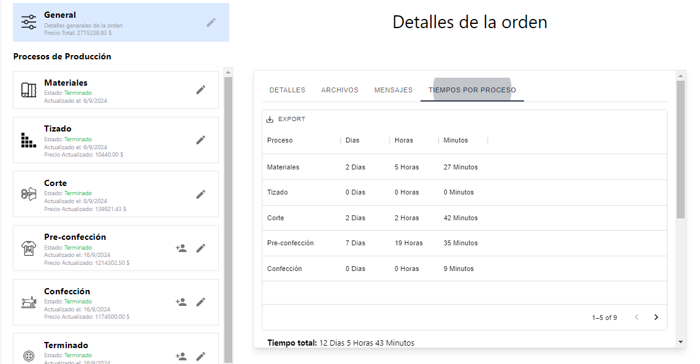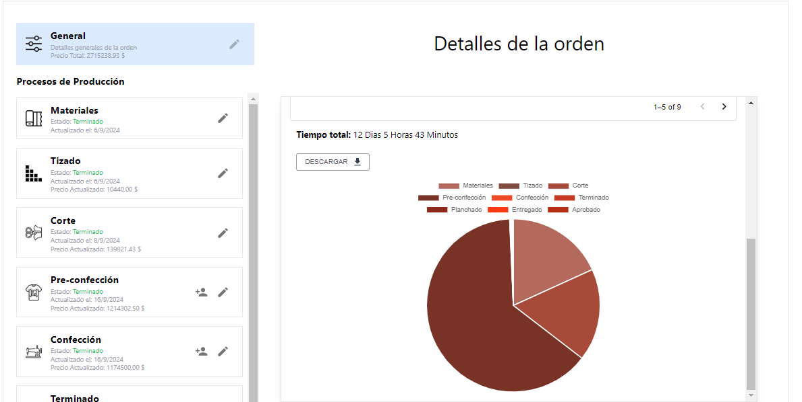

Finalmente, el usuario con rol *Administrador* podra ver todos los reportes y estadisticas de todas las ordenes.

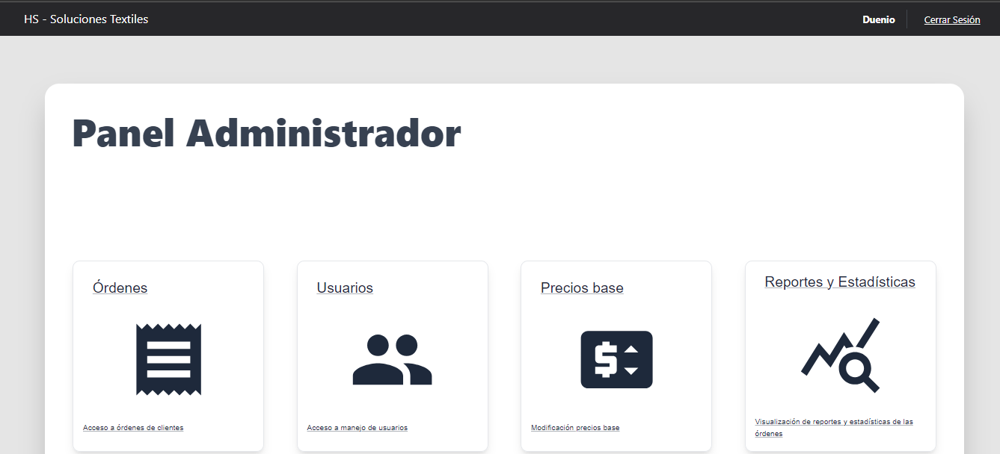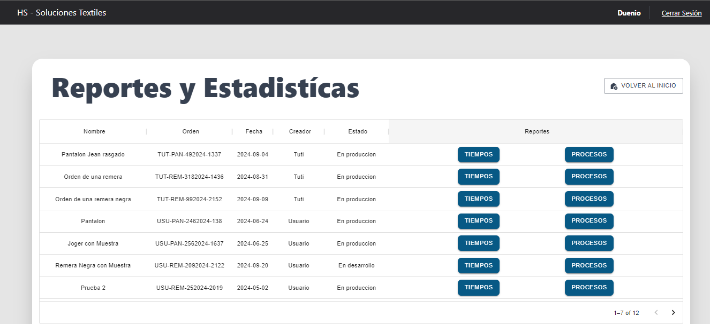
