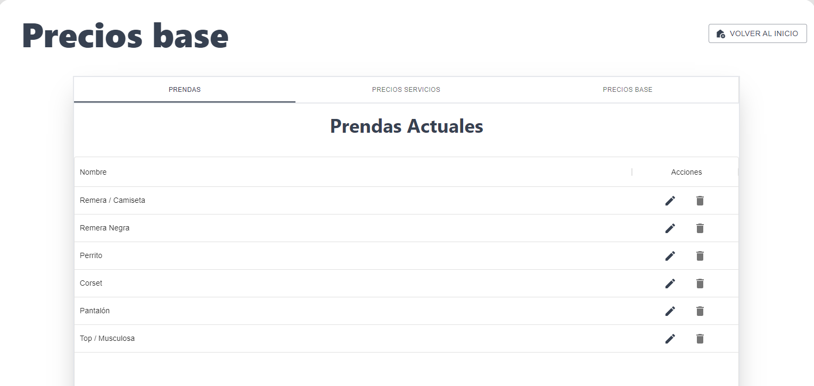

### Sitio web para Taller-HS

## Indice

- [Objetivos](#objetivos)
- [Funcionalidad del proyecto](#funcionalidad)
  - [Roles](#roles)
  - [Complejidad](#complejidad)
  - [Funcionalidades por Rol](#funcionalidades-por-rol)

<a name="objetivos"/>

## Objetivos

Este proyecto surgio como una alternativa de desarrollo planteada a los alumnos de la Universidad
Católica Argentina en el marco de la materia Proyecto Integral de Desarrollo, cuyo objetivo es mejorar las
prácticas de programación trabajando en diversos proyectos que otorguen y agreguen valor a los
clientes.

Taller HS es un emprendimiento que se dedica a la confección de diversas prendas de ropa
personalizadas en base a las necesidades y pedidos particulares de cada cliente.

Los objetivos del proyecto a desarrollar consisten en agilizar la creación de nuevas cotizaciones de
prendas y mantener un seguimiento del flujo de los estados de las órdenes creadas, con la finalidad que
los clientes dispongan de un sitio para visualizar sus órdenes y los estados en los que se encuentran.

Este desarrollo web permitirá a Taller HS facilitar la parte de la cotización de prendas y a la vez que ahorrar tiempo
a la hora de informar al cliente el estado de sus órdenes, ya que será posible consultarlas dentro del
portal web.

<a name="funcionalidad"/>

## Funcionalidad del proyecto

<a name="roles"/>

### Roles

En la aplicacion se tienen 4 roles de los usuarios que se registran:

- **Cliente**: un usuario que puede crear ordenes y visualizarlas.
- **Prestador de Servicio**: un usuario, que esta por fuera del HS Taller, que trabaja en las ordenes.
- **Administrador**: un usuario con posibilidad de gestionar todas las ordenes, servicios, usuarios, reportes y estadisticas.
- **Ayudante**: un usuario ,que forma parte de HS Taller, que trabaja en las ordenes.

<a name="complejidad"/>

### Complejidad

Uno de los puntos más importantes a la hora de determinar el precio de las prendas a producir es poder determinar su complejidad. Según que tan compleja sea una prenda, su precio va a variar y el estimado que el cotizador arroje se verá modificado. Se establecieron seis distintas complejidades:

- Básico.
- Medio.
- Complejo.
- Muy Complejo.
- Ultra Complejo.
- Extremadamente Complejo.

Para que el cotizador pueda funcionar de manera precisa indicando el precio, es necesario que tenga en cuenta cuál es la complejidad de la prenda.

<a name="funcionalidades-por-rol"/>

### Funcionalidades por Rol

Se describiran las funcionalidades principales brindadas por la aplicación por rol de usuario:

- **Cliente**

  - Poder crear una orden y obtener su precio estimado para los usuarios Cliente: 

  - Poder visualizar las ordenes creadas: 

  - Poder editar sus propios datos: 

- **Prestador de Servicio**:

  - Poder visualizar y trabajar en las ordenes en donde se le fue asignado un proceso: 

  - Poder editar sus propios datos: 

  - Poder editar sus propios precios de servicios: 

- **Administrador**:

  - Poder visualizar y trabajar en todas las ordenes creadas: 

  - Poder editar sus propios precios de servicios: 

  - Poder editar los usuarios: 

  - Poder ver los reportes y estadisticas de las ordenes: 

- **Ayudante**:
  - Poder visualizar y trabajar en todas las ordenes creadas: 

    <a name="complejidad"/>
